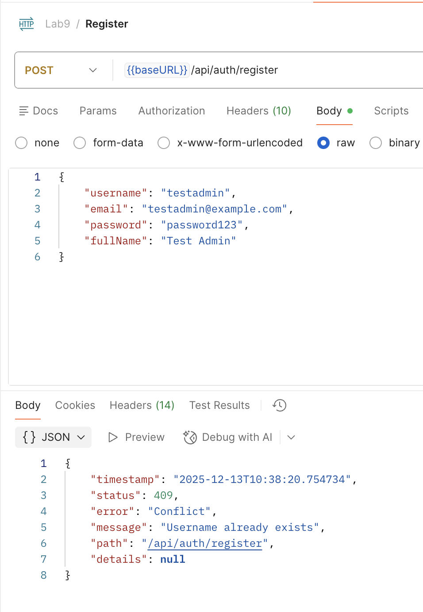
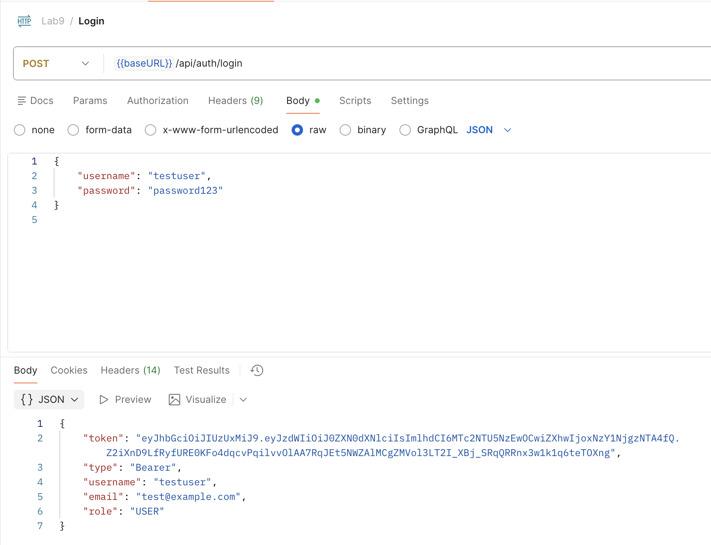
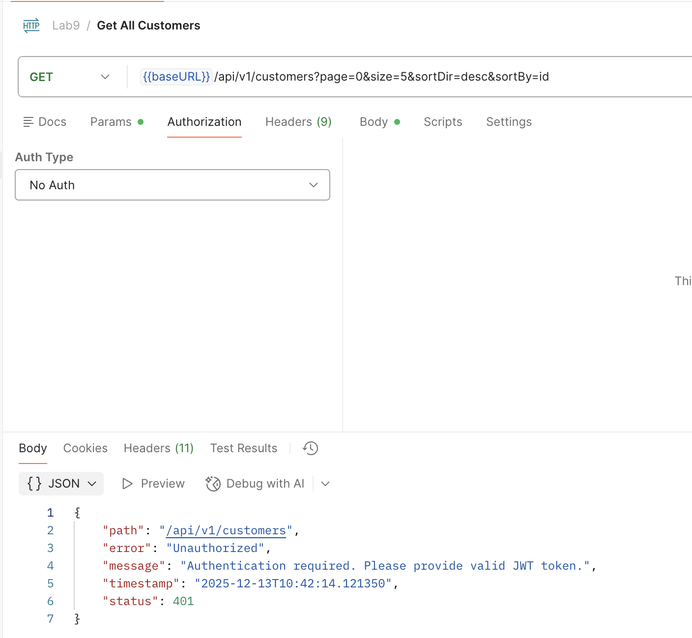
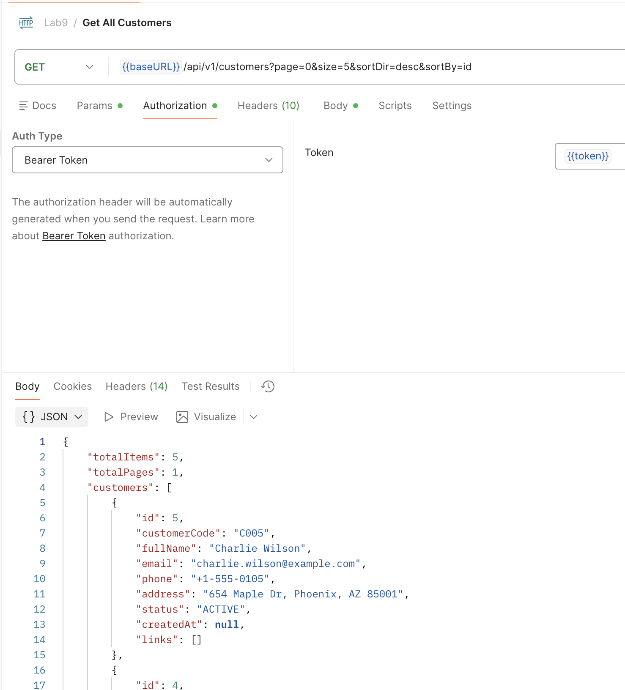
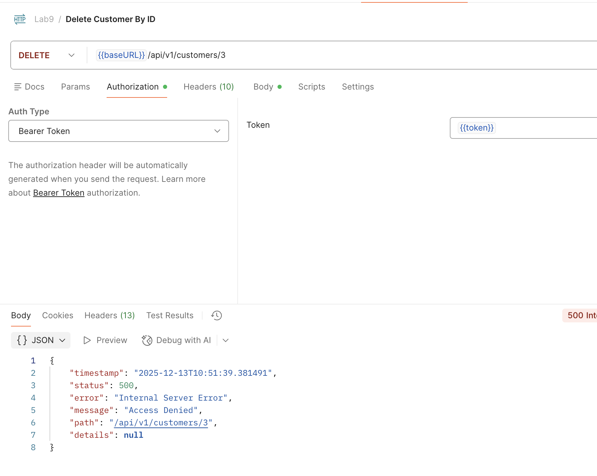
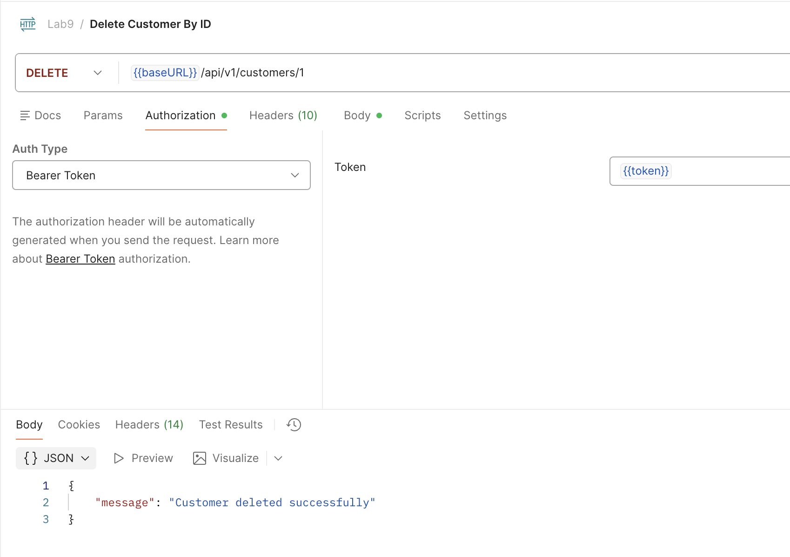

# Lab 8 EXERCISES: REST API & DTO PATTERN

## EXERCISE 1: PROJECT SETUP & USER ENTITY (15 points)

### Task 1.1: Add Security Dependencies (5 points)

[pom.xml](customer-api/pom.xml)

### Create User Entity and Role Enum (5 points)

**NOTE:** Using Lombok to create `@Getter` and `@Setter`

[Role.java](customer-api/src/main/java/org/example/customerapi/enum_class/Role.java)

[User.java](customer-api/src/main/java/org/example/customerapi/entity/User.java)

### Task 1.3: Database Setup (5 points)

[database.sql](customer-api/database/database.sql)

[application.properties](customer-api/src/main/resources/application.properties)

## EXERCISE 2: DTO & REPOSITORY (10 points)

### Task 2.1: Create Authentication DTOs (5 points)

- [LoginRequestDTO](customer-api/src/main/java/org/example/customerapi/dto/LoginRequestDTO.java)
- [LoginResponseDTO](customer-api/src/main/java/org/example/customerapi/dto/LoginResponseDTO.java)
- [RegisterRequestDTO](customer-api/src/main/java/org/example/customerapi/dto/ResgisterRequestDTO.java)
- [UserResponseDTO](customer-api/src/main/java/org/example/customerapi/dto/UserResponseDTO.java)

### Task 2.2: Create User Repository (5 points)

[UserRepository.java](customer-api/src/main/java/org/example/customerapi/repository/UserRepository.java)

## EXERCISE 3: JWT & SECURITY COMPONENTS (20 points)

### Task 3.1: Create JWT Token Provider (8 points)

[JWTProvider.java](customer-api/src/main/java/org/example/customerapi/security/JwtTokenProvider.java)

### Task 3.2: Create JWT Authentication Filter (7 points)

[JWTAuthenticationFilter.java](customer-api/src/main/java/org/example/customerapi/security/JwtTokenProvider.java)

### Task 3.3: Create Custom UserDetailsService (5 points)

[CustomUserDetailService.java](customer-api/src/main/java/org/example/customerapi/service/CustomUserDetailsService.java)

## EXERCISE 4: SECURITY CONFIGURATION (15 points)

### Task 4.1: Create Security Config (10 points)

[SecurityConfig.java](customer-api/src/main/java/org/example/customerapi/security/SecurityConfig.java)

### Task 4.2: Create Authentication Entry Point (5 points)

[JWTAuthenticationEntryPoint.java](customer-api/src/main/java/org/example/customerapi/security/JwtAuthenticationEntryPoint.java)

## EXERCISE 5: USER SERVICE & AUTH CONTROLLER (remaining time)

### Task 5.1: Implement User Service (Points included in completion)

#### Interface

Create 3 abstract methods in the interface to handle `login(), register(), getCurrentUser()`

[UserService.java](customer-api/src/main/java/org/example/customerapi/service/UserService.java)

#### Implementation

Call Associated the `Repository` method

[UserServiceImpl.java](customer-api/src/main/java/org/example/customerapi/service/UserServiceImpl.java)

### Task 5.2: Create Auth Controller (Points included in completion)

Implement the endpoints the same as the task and use the associated `service`.

[AuthController.java](customer-api/src/main/java/org/example/customerapi/controller/v1/AuthController.java)

### Task 5.3: Update Customer Controller (Points included in completion)

[AuthController.java](customer-api/src/main/java/org/example/customerapi/controller/v1/AuthController.java)

- Test register

- Test login

- Test Protected Endpoint (Without Token)

- Test Protected Endpoint (With Token)

- Test Authorization (USER trying to DELETE)

- Test Authorization (ADMIN trying to DELETE)

