# Report Homework

## EXERCISE 6: PASSWORD MANAGEMENT (12 points)

### Task 6.1: Change Password Endpoint (6 points)

- Create DTO:

[ChangePasswordDTO.java](customer-api/src/main/java/org/example/customerapi/dto/ChangePasswordDTO.java)

- Add to AuthController:

[AuthController.java](customer-api/src/main/java/org/example/customerapi/controller/v1/AuthController.java)

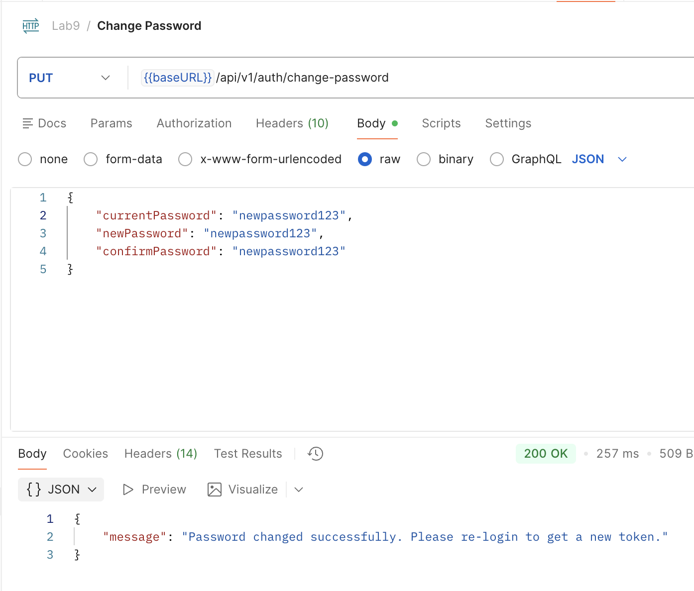

### Task 6.2: Forgot Password (6 points)

- Create password reset token system:
    1. Add fields to User entity:

        ```java
            // Password reset token fields
            @Column(name = "reset_token", length = 255)
            private String resetToken;

            @Column(name = "reset_token_expiry")
            private LocalDateTime resetTokenExpiry;
        ```

    2. POST /api/auth/forgot-password
        - Call the `UserSevice.forgotPassword`
        - Generate reset token `user.setResetToken(token)`
        - Save token and expiry (e.g., 1 hour) using the `LocalDateTime expiry = LocalDateTime.now().plusHours(1)`
        - Return token (in real app, send via email).

        ```java
            // Public endpoint to request a password reset token by email
            @PostMapping("/forgot-password")
            public ResponseEntity<Map<String, String>> forgotPassword(@Valid @RequestBody ForgotPasswordRequestDTO request) {
                String token = userService.forgotPassword(request);
                Map<String, String> response = new HashMap<>();
                // In production, you would email this token; returning for demo/testing purpose
                response.put("resetToken", token);
                response.put("message", "If the email exists, a reset token has been generated.");
                return ResponseEntity.ok(response);
            }
        ```

    3. POST /api/auth/reset-password
        - Verify reset token is valid and not expired

            ```java
                User user = userRepository.findByResetToken(request.getResetToken())
                .orElseThrow(() -> new ResourceNotFoundException("Invalid password reset token"));
            ```

        - Update password: `user.setPassword(passwordEncoder.encode(request.getNewPassword()));`
        - Clear reset token `user.setResetToken(null); user.setResetTokenExpiry(null);`

        ```java
            @PostMapping("/reset-password")
            public ResponseEntity<Map<String, String>> resetPassword(@Valid @RequestBody ResetPasswordRequestDTO request) {
                userService.resetPassword(request);
                Map<String, String> response = new HashMap<>();
                response.put("message", "Password reset successfully. You can now log in with your new password.");
                return ResponseEntity.ok(response);
            }
        ```

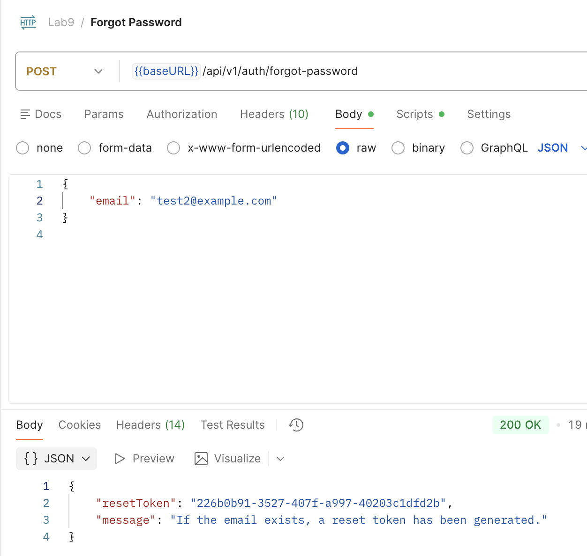
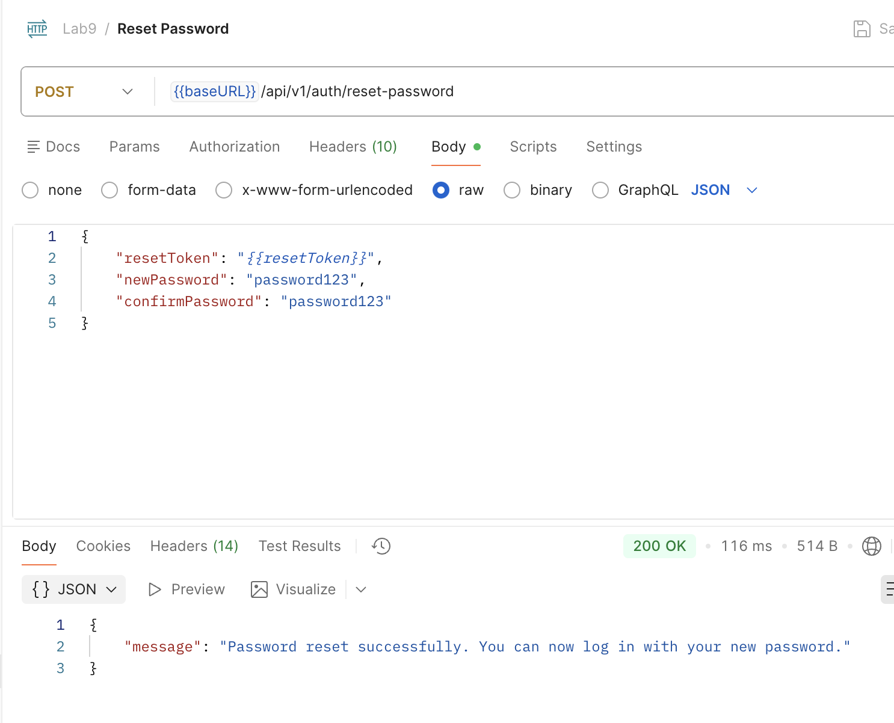

## EXERCISE 7: USER PROFILE MANAGEMENT (10 points)

### Task 7.1: View Profile (3 points)

1. Get the authentication data to verify the user
2. Based on the data, we extract the username to file thier profile
3. Reponse back to the user

```java
    @GetMapping("/profile")
    @PreAuthorize("isAuthenticated()")
    public ResponseEntity<UserResponseDTO> getProfile() {
        // Retrieve and return the authenticated user's profile
        Authentication authentication = SecurityContextHolder.getContext().getAuthentication();

        String username = authentication.getName();
        UserResponseDTO userResponseDTO = userService.getCurrentUser(username);
        return ResponseEntity.ok(userResponseDTO);

    }
```

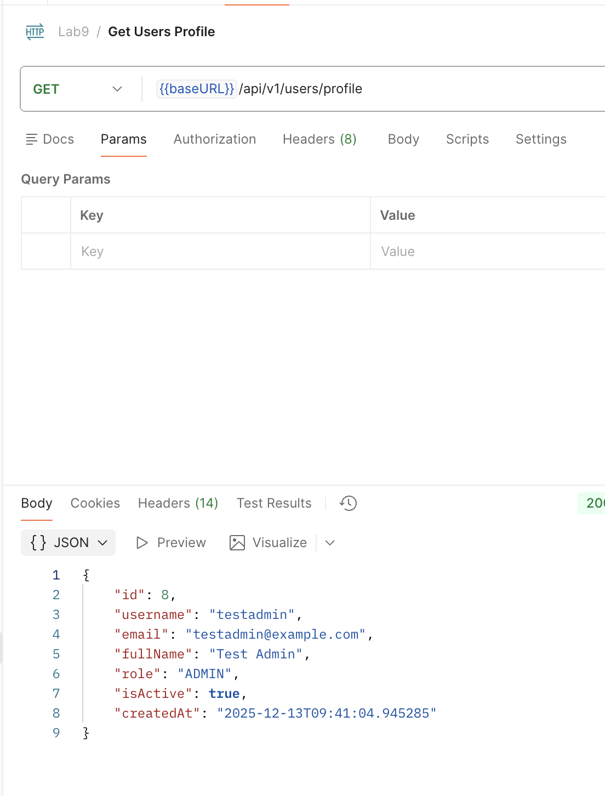


### Task 7.2: Update Profile (4 points)

1. Get the user name authentication
2. Based on the body request of the `PUT` method to update the user profile through the its service.
3. Save the output of the update and response back to the user.

[UpdateProfileDTO.java](customer-api/src/main/java/org/example/customerapi/dto/UpdateRoleDTO.java)

```java
    @PutMapping("/profile")
    @PreAuthorize("isAuthenticated()")
    public ResponseEntity<UserResponseDTO> updateProfile(@Valid @RequestBody UpdateProfileDTO dto) {
        // Update and return the authenticated user's profile
        Authentication authentication = SecurityContextHolder.getContext().getAuthentication();
        String username = authentication.getName();
        UserResponseDTO updatedUser = userService.updateProfile(username, dto);
        return ResponseEntity.ok(updatedUser);
    }
```

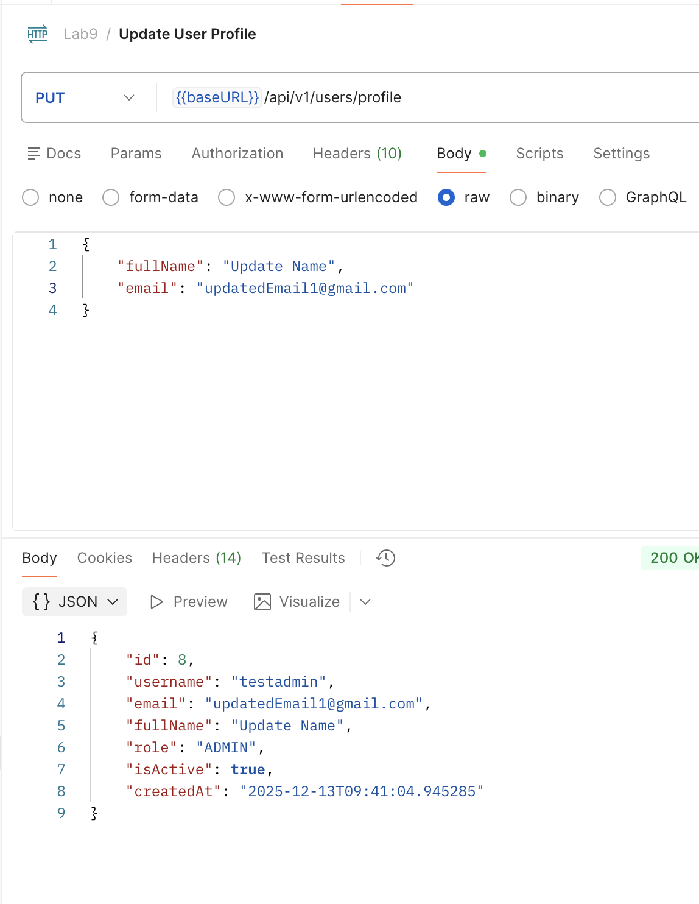


### Task 7.3: Delete Account (3 points)

1. Reverify the user password to confirm the account
2. Get the username through the authentication
3. Using the soft delete basd on the action we disable the account from `ACTIVE` to `INACTIVE`.
4. Response to user that Account is deactive.

```java
    @DeleteMapping("/account")
    @PreAuthorize("isAuthenticated()")
    public ResponseEntity<?> deleteAccount(@RequestParam String password) {
        // Verify password and soft-delete account
        Authentication authentication = SecurityContextHolder.getContext().getAuthentication();
        String username = authentication.getName();
        userService.deleteAccount(username, password);

        Map<String, String> response = new HashMap<>();
        response.put("message", "Account has been deactivated successfully.");
        return ResponseEntity.ok(response);
    }
```

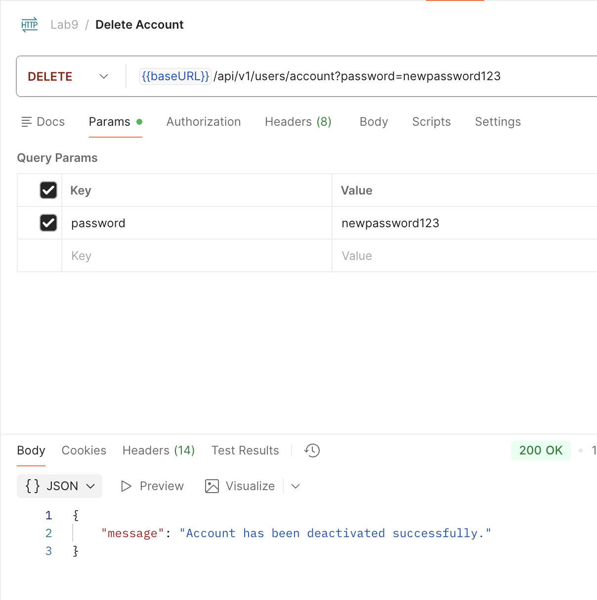


## EXERCISE 8: ADMIN ENDPOINTS (10 points)

### Task 8.1: List All Users (3 points)

1. Using the annotation `@PreAuthorize` to verify the role of users
2. Call the `UserService` to use the method get all users to extract all the data
3. Response back all the data to the ADMIN.

```java
    // Task 8.1: List All Users
    @GetMapping("/users")
    @PreAuthorize("hasRole('ADMIN')")
    public ResponseEntity<List<UserResponseDTO>> getAllUsers() {
        List<UserResponseDTO> users = userService.getAllUsers();
        return ResponseEntity.ok(users);
    }
```

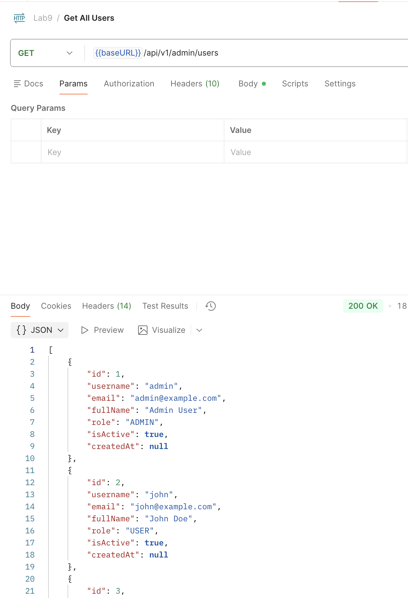

### Task 8.2: Update User Role (4 points)

- Create the DTO: [UpdateRoleDTO.java](customer-api/src/main/java/org/example/customerapi/dto/UpdateRoleDTO.java)
- Add endpoint:
    1. Using the annotation `@PreAuthorize` to verify the role of users
    2. Get the body of the method
    3. Call the `UserService` to update the user role.
    4. Response back all the data to the ADMIN.

    ```java
        @PutMapping("/users/{id}/role")
        @PreAuthorize("hasRole('ADMIN')")
        public ResponseEntity<UserResponseDTO> updateUserRole(
                @PathVariable Long id,
                @Valid @RequestBody UpdateRoleDTO dto) {
            UserResponseDTO updated = userService.updateUserRole(id, dto);
            return ResponseEntity.ok(updated);
        }
    ```

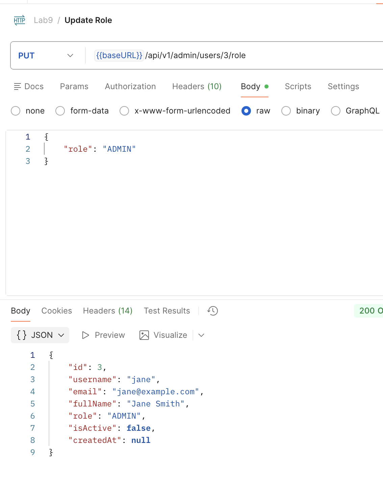


### Task 8.3: Deactivate/Activate User (3 points)

1. Using the annotation `@PreAuthorize` to verify the role of users
2. Call the `UserService` to update the user status modify from the `ACTIVE` to `INACTIVE`, reversely.
3. Response back all the data to the ADMIN.

```java
    @PatchMapping("/users/{id}/status")
    @PreAuthorize("hasRole('ADMIN')")
    public ResponseEntity<UserResponseDTO> toggleUserStatus(@PathVariable Long id) {
        UserResponseDTO updated = userService.toggleUserStatus(id);
        return ResponseEntity.ok(updated);
    }
```

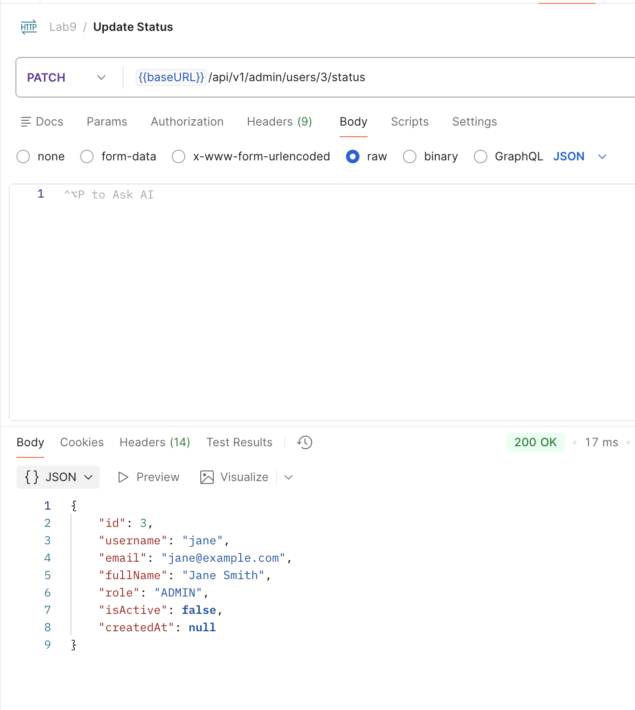


## EXERCISE 9: REFRESH TOKEN (8 points)

### Task 9.1: Create Refresh Token Entity (3 points)

[RefreshToken.java](customer-api/src/main/java/org/example/customerapi/entity/RefreshToken.java)

### Task 9.2: Generate Refresh Token (2 points)

1. Authenticate user by `USERNAME` and `PASSWORD`
2. Generate JWT access token
3. Get user details by `USERNAME`
4. Generate the refresh token using the UUID and set associated user and expired data
5. Try and except the login to test

```java
    @Override
    public LoginResponseDTO login(LoginRequestDTO loginRequest, jakarta.servlet.http.HttpServletRequest request) {
        // Authenticate user
        Authentication authentication = authenticationManager.authenticate(
                new UsernamePasswordAuthenticationToken(
                        loginRequest.getUsername(),
                        loginRequest.getPassword()
                )
        );

        SecurityContextHolder.getContext().setAuthentication(authentication);

        // Generate JWT access token
        String token = tokenProvider.generateToken(authentication);

        // Get user details
        User user = userRepository.findByUsername(loginRequest.getUsername())
                .orElseThrow(() -> new ResourceNotFoundException("User not found"));

        // Create refresh token (7 days)
        String refreshTokenValue = UUID.randomUUID().toString();
        RefreshToken refreshToken = new RefreshToken();
        refreshToken.setUser(user);
        refreshToken.setToken(refreshTokenValue);
        refreshToken.setExpiryDate(LocalDateTime.now().plusDays(7));
        refreshTokenRepository.save(refreshToken);

        // Log successful login
        try {
            String ip = extractClientIp(request);
            String userAgent = request != null ? request.getHeader("User-Agent") : null;
            LoginHistory history = new LoginHistory();
            history.setUser(user);
            history.setIpAddress(ip);
            history.setUserAgent(userAgent);
            history.setLoginTime(LocalDateTime.now());
            loginHistoryRepository.save(history);
        } catch (Exception ignored) {
            // Avoid breaking login flow due to logging errors
        }

        return new LoginResponseDTO(
                token,
                user.getUsername(),
                user.getEmail(),
                user.getRole().name(),
                refreshTokenValue
        );
    }
```

### Task 9.3: Refresh Access Token (3 points)

1. Get the user token
2. Create the new token
3. Create the Login Response
4. Response back to the user

```java
    @PostMapping("/refresh")
    public ResponseEntity<LoginResponseDTO> refreshToken(@RequestBody RefreshTokenDTO dto) {
        RefreshToken rt = refreshTokenRepository.findByToken(dto.getToken())
                .orElseThrow(() -> new IllegalArgumentException("Invalid refresh token"));

        if (rt.getExpiryDate() == null || rt.getExpiryDate().isBefore(LocalDateTime.now())) {
            throw new IllegalArgumentException("Refresh token has expired");
        }

        User user = rt.getUser();
        String newAccessToken = tokenProvider.generateTokenFromUsername(user.getUsername());

        LoginResponseDTO response = new LoginResponseDTO(
                newAccessToken,
                user.getUsername(),
                user.getEmail(),
                user.getRole().name(),
                rt.getToken()
        );
        return ResponseEntity.ok(response);
    }
```

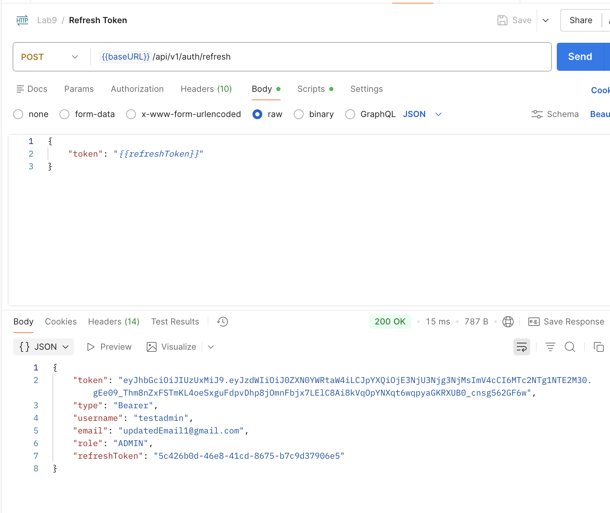

## BONUS 2: Login Activity Log (6 points)

1. Create the login history entity [LoginHistory.java](customer-api/src/main/java/org/example/customerapi/entity/LoginHistory.java)
2. Create the user login history and save the login history into the database.

    ```java
        String ip = extractClientIp(request);
        String userAgent = request != null ? request.getHeader("User-Agent") : null;
        LoginHistory history = new LoginHistory();
        history.setUser(user);
        history.setIpAddress(ip);
        history.setUserAgent(userAgent);
        history.setLoginTime(LocalDateTime.now());
        loginHistoryRepository.save(history);
    ```

3. Create the endpoint and using `Userservice.login()` to execute the request.

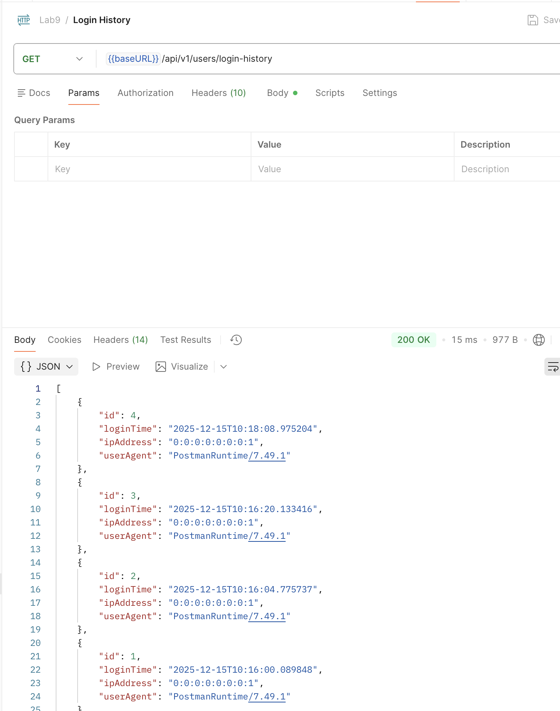
